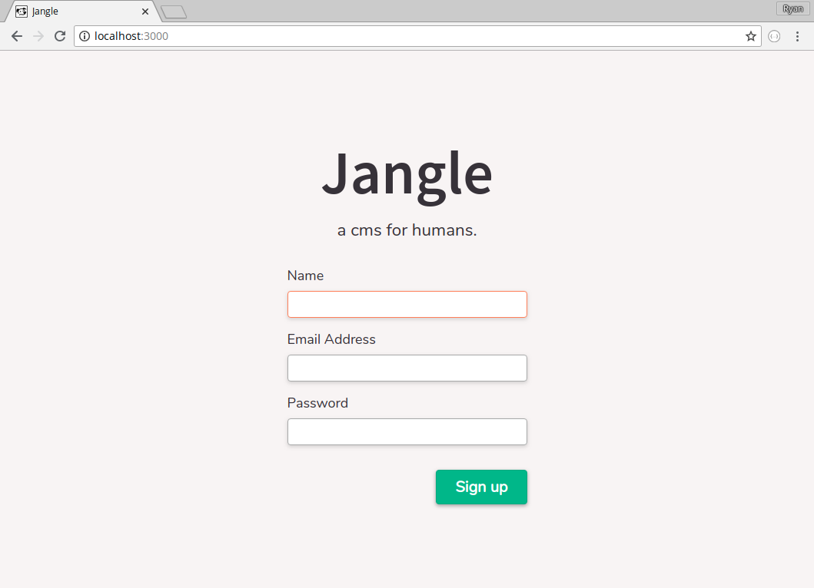
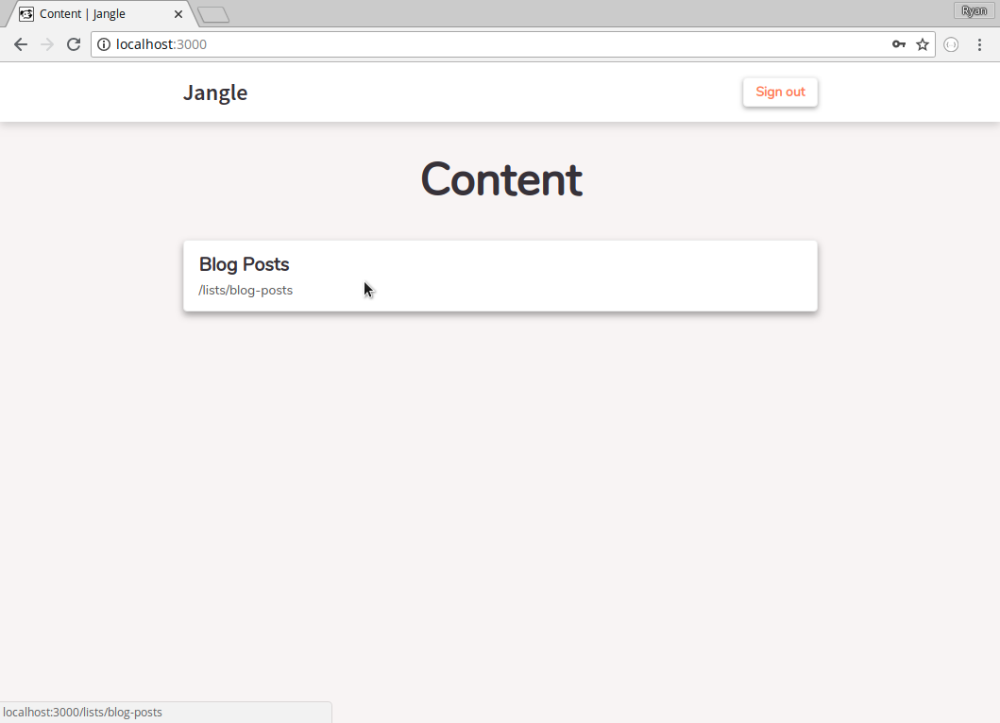
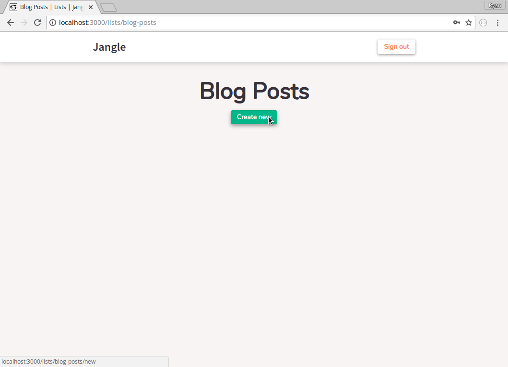
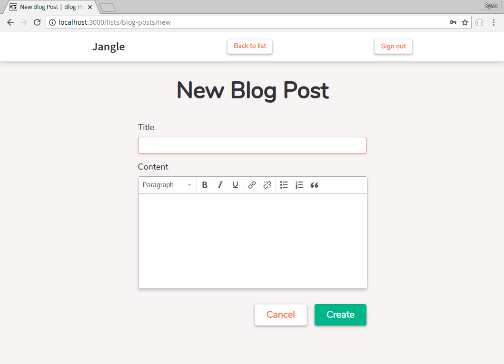
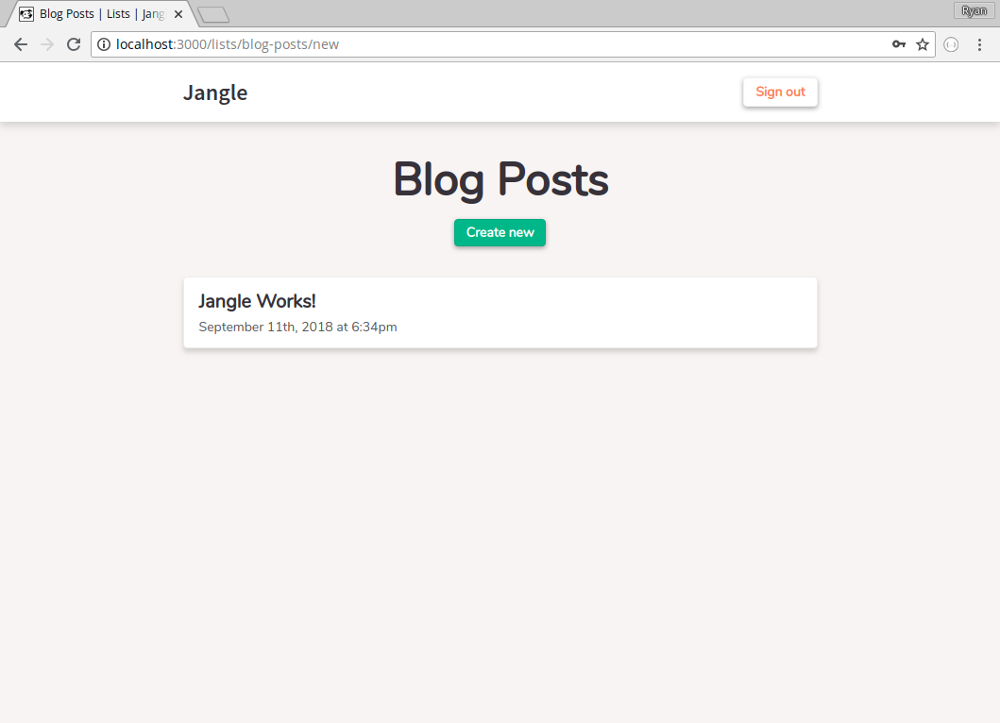
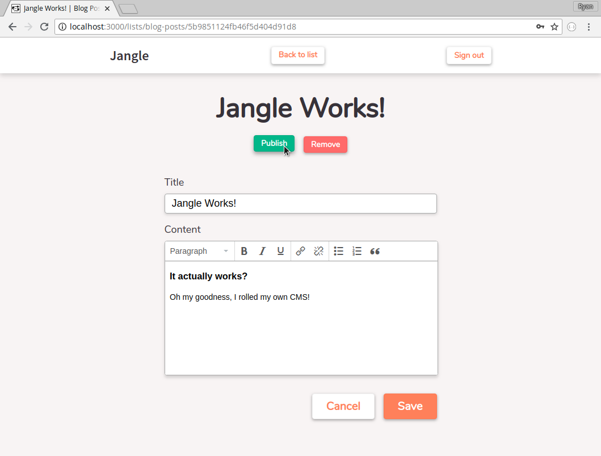
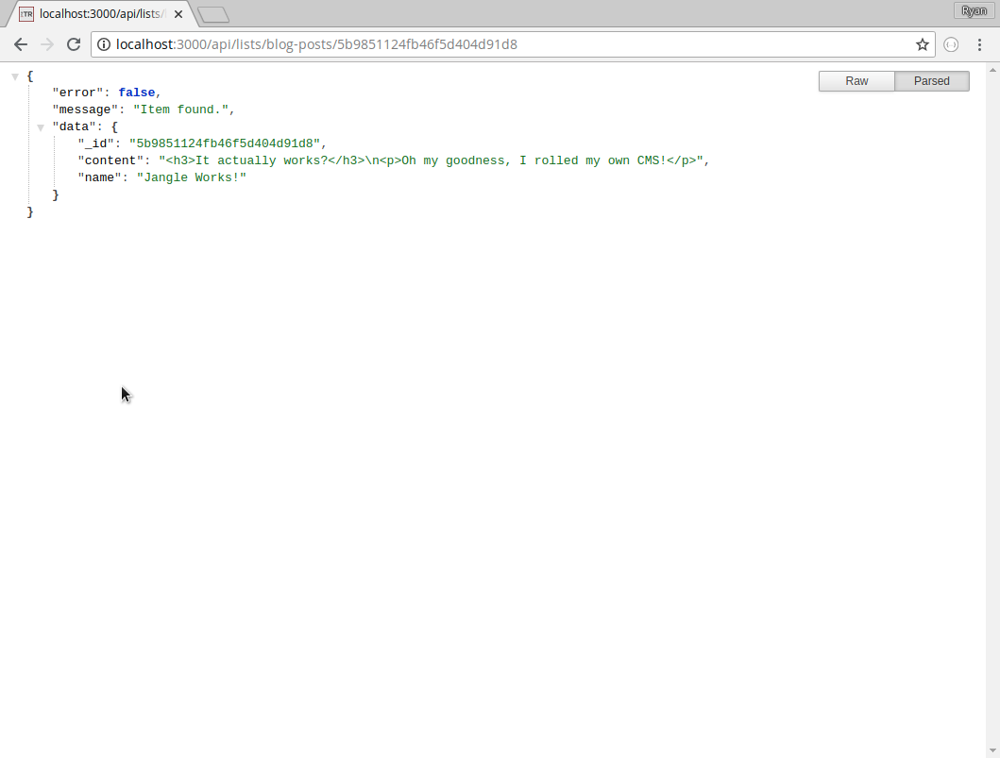

# Jangle | Demo
> A demo of Jangle CMS

### Try it with Heroku (free)

### Try it locally (also free)

1. __`docker-compose up`__ - (Runs MongoDB on port 27017)

1. __`npm install`__

1. __`npm run dev`__

### Quick Guide

Here is a quick series of screenshots to give you a sneak peek of the UI:

